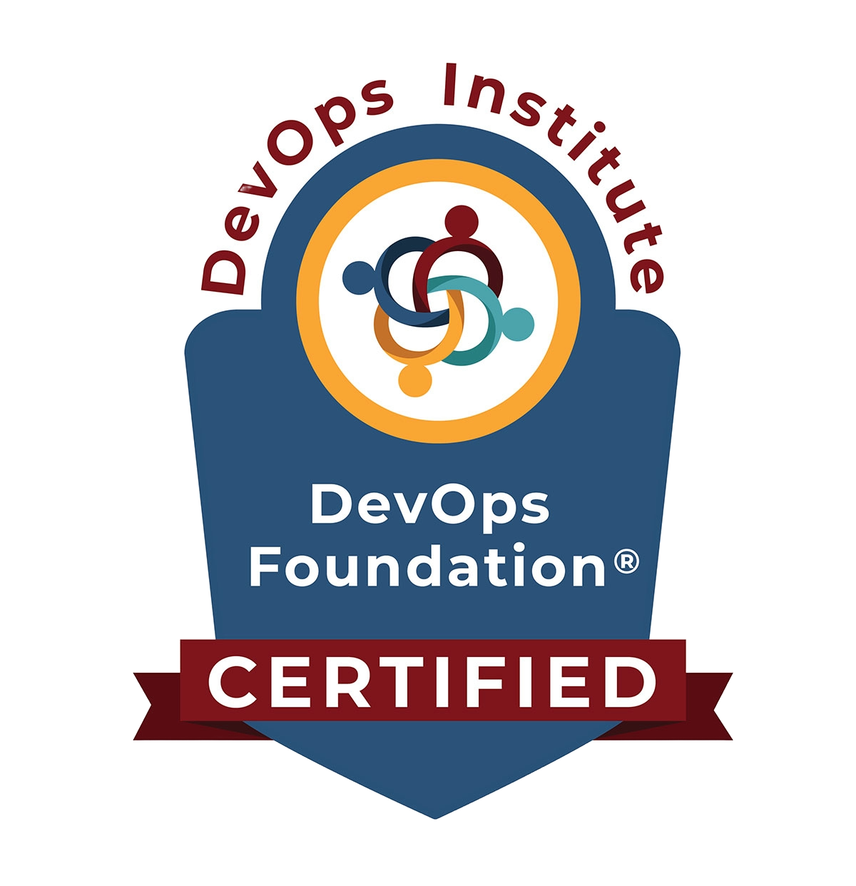

----
### ➡️ &nbsp;About Me

    <strong>
            Invested in creating high-performing technological ecosystems, my philosophy is built on collaboration, communication, and knowledge sharing.  
            I am driven by a passion for continuous learning, exploring .NET, back-end technologies, software and web development, cloud computing, DevOps, Object-Oriented Programming, Design Patterns, and Problem Solving skills.
              
            My unconventional professional journey reflects my determination to constantly broaden my skill set and to remain attentive and open to technological advancements.
    </strong>

----
### 📉 &nbsp;GitHub Analytics

 

    

    

----
### 📚 &nbsp;Repositories

  

    
  

  

    
  

  

    
  

  

    
  

  

    
  

  

    
  

----
### 🛠️ &nbsp;Skills

- 📋 Languages:

    

- 📋 Frameworks & Libraries:

    

- ☁️ Cloud:

    

- ♾️ DevOps:

    

- 💾 Databases:

    

- 🔍 Testing:

    

- 🎛️ Operating Systen:

    

- 💻 IDEs/Editors:

  

- 💻 Versionning & Tools:

  

----
### 🏆 &nbsp;Certifications

 

    
    
    

----
### 🌐 &nbsp;Contact

 

     

         
     

    

         
    

----

     Thanks for watching my profile! Have a nice day! 😉

    @ 2024
    <a href="https://github.com/SebastienSiddi">
        Sébastien Siddi
    </a>

